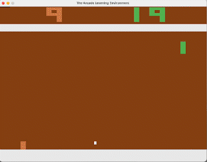
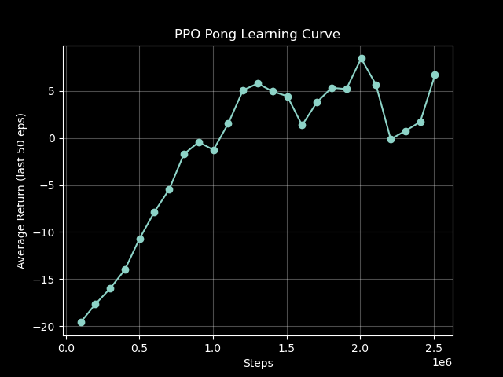
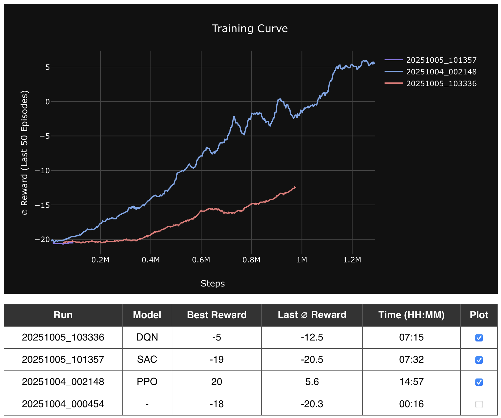

# Ping Pong Training

This projectd tests and compares a wide range of Reinforcement Learning (RL) models to train agents that play Ping Pong. The Arcade Learning Environment (ALE) is a widely recognized framework that provides a challenging and diverse set of Atari 2600 games, enabling the development and evaluation of AI agents through interaction with raw pixel inputs, discrete actions, and game scores in a controlled emulated environment (Fig. 1). In the visualization, the orange paddle represents the built-in opponent, while the green paddle represents the trained agent.

<p align="center">
  
  <br><em>Fig. 1: Deep reinforcement learning agent<br> training on Atari Pong using PPO.</em>
</p>


## Project Overview

This project implements and compares various reinforcement learning agents that learn to play Atari Pong from raw pixel inputs. Key features include frame preprocessing, frame stacking for motion capture, convolutional neural networks for visual processing, and reward shaping to encourage effective behaviors.

## Models Overview

| Abbreviation | Name                                          | Key Features                                                                                          |
|--------------|-----------------------------------------------|-----------------------------------------------------------------------------------------------------|
| DQN          | Deep Q-Network                                | Value-based, uses CNN with Q-learning, experience replay, target networks, good for discrete action spaces |
| PPO          | Proximal Policy Optimization                  | On-policy, robust and stable policy gradients, uses clipping to constrain policy updates, widely used baseline |
| SAC          | Soft Actor-Critic                             | Off-policy, actor-critic method, encourages exploration via entropy maximization, works well in continuous spaces |
| A3C          | Asynchronous Advantage Actor-Critic           | Multiple agents in parallel, combines policy and value learning, improves sample efficiency and exploration |
| TD3          | Twin Delayed Deep Deterministic Policy Gradients | Off-policy, addresses overestimation in DDPG, uses two critics, target smoothing, suited for continuous actions |
| DDPG         | Deep Deterministic Policy Gradient            | Off-policy, suitable for continuous control, deterministic actor-critic, experience replay, requires careful tuning |
| HER          | Hindsight Experience Replay                   | Re-labels failed experiences as successes for sparse rewards, often combined with DDPG/TD3           |
| HRL          | Hierarchical Reinforcement Learning           | Incorporates hierarchies of policies or skills, enables learning complex behaviors like strategy and tactics |
| IRL          | Inverse Reinforcement Learning                 | Learns reward functions from expert demonstrations, useful for mimicking real players or strategies  |
| APRG         | Actor-Parametrized Reward Gradient             | Deterministic policy gradient, sample efficient, robust for noisy real-world table tennis settings    |


## Requirements

```bash
pip install -r requirements.txt
```

## Usage

### Training

```bash
python train_ppo.py
```

Training parameters:
- **Total timesteps**: 3,000,000
- **Steps per update**: 2,048
- **Batch size**: 64
- **Update epochs**: 8
- **Learning rate**: 2.5e-4

Results are saved to `results/run_<timestamp>/` including:
- Training curves (PNG)
- Performance metrics (CSV)
- Model checkpoints (Keras)


## Architecture

### Neural Network
```
Input (80x80x4) 
  → Conv2D(32, 8x8, stride=4) + ReLU
  → Conv2D(64, 4x4, stride=2) + ReLU  
  → Conv2D(64, 3x3, stride=1) + ReLU
  → Flatten
  → Dense(512) + ReLU
  → Policy Head: Dense(6) [action logits]
  → Value Head: Dense(1) [state value]
```

### Hyperparameters

| Parameter | Value | Description |
|-----------|-------|-------------|
| γ (gamma) | 0.99 | Discount factor |
| λ (lambda) | 0.95 | GAE parameter |
| ε (epsilon) | 0.2 | PPO clip ratio |
| Learning rate | 2.5e-4 | Adam optimizer |
| Value coef | 0.5 | Value loss weight |
| Entropy coef | 0.01 | Exploration bonus |
| Max grad norm | 0.5 | Gradient clipping |

## Expected Results

With proper training, the agent should:
- Reach positive average rewards (~5-15) after ~500k steps
- Achieve competitive play (winning most games) by 1-2M steps
- Final performance: 15-21 average reward over 50 episodes

Training time: ~2-4 hours on GPU, ~12-24 hours on CPU.

## File Structure

```
.
├── train_ppo.py            # Main training script
├── db.py                   # NeonDB upload setup
├── requirements.txt        # Dependenices
├── results/
│   └── run_YYYYMMDD_HHMMSS/
│       ├── best.keras                  # Model checkpoint at highest return
│       ├── last.keras                  # Model checkpoint at last save interval
│       ├── best_episode_results.csv    # Highest reward so far in an episode
│       ├── training_results.csv        # Log ∅ return every 100 000 steps 
│       ├── training_log.csv            # Log ∅ return, elapsed time every 2048 steps 
│       ├── config_kv.csv               # configuration key-value pair
│       └── learning_curve.png          # Plot ∅ return vs. training steps
├── studies/                # References for this project
└── README.md               # This document
```

## Results

- `training_results.csv` saves the logged training progress as a table with the total steps and corresponding average return values.
- `learning_curve.png` visualizes this progress, showing how the agent’s average return evolves over training steps.

<p align="center">
  
  <br><em>Fig. 2: PPO Training Progress.</em>
</p>

## Evaluation

To test the trained PPO agent, navigate to the results of the latest run and execute the evaluate function from train_ppo.py, for example:

```bash
python -c "import train_ppo; train_ppo.evaluate('results/run_20251004_002148/best.keras')"
```

## Monitoring

Training RL models for over 3 million steps takes several hours to days, making remote monitoring of progress essential. For this project, I have set up [Weights & Biases (wandb)](https://wandb.ai) monitoring initially, and later implemented custom monitoring using NeonDB and [Render](https://rl-dashboard-frontend.onrender.com).

<p align="center">
  
  <br><em>Fig. 3: Remote Monitoring using NeonDB and Render.</em>
</p>

## Troubleshooting

**Training is slow**: 
- Ensure TensorFlow is using GPU: `tf.config.list_physical_devices('GPU')`
- Reduce `total_timesteps` or `n_steps`

**Agent not learning**:
- Check that rewards are being received (print episode returns)
- Verify frame preprocessing is working correctly
- Try adjusting learning rate or entropy coefficient

**Memory issues**:
- Reduce `n_steps` or `batch_size`
- Use mixed precision training

## Acknowledgments

- OpenAI Gym/Gymnasium for the Atari environment

## License

MIT