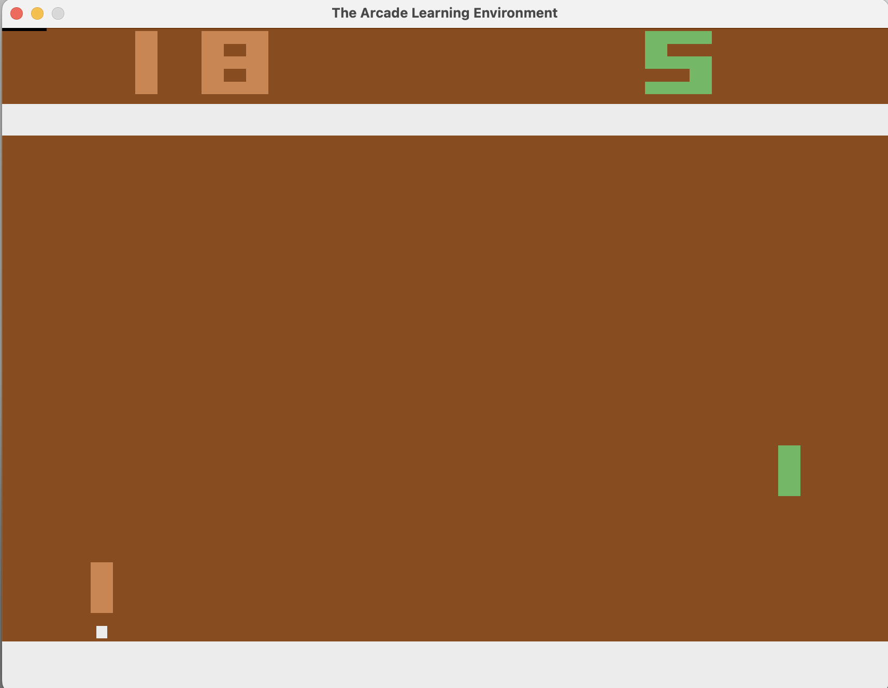

# Ping Pong Training

Deep Reinforcement Learning agent that learns to play Atari Pong using Proximal Policy Optimization (PPO). The Arcade Learning Environment (ALE) is a widely recognized framework that provides a challenging and diverse set of Atari 2600 games, enabling the development and evaluation of AI agents through interaction with raw pixel inputs, discrete actions, and game scores in a controlled emulated environment (Fig. 1).

<div style="text-align:center;">
  
  <p style="font-style:italic;">Fig.: Deep reinforcement learning agent<br> training on Atari Pong using PPO.</p>
</div>

## How PPO Works

Mnih et al. (2013) in the study ["Playing Atari with Deep Reinforcement Learning"](https://arxiv.org/abs/1312.5602) introduced the Deep Q-Network (DQN), which combined deep convolutional neural networks (CNN) with Q-learning to learn control policies directly from raw sensory inputs, achieving human-level performance on Atari games. 

Building on advancements in reinforcement learning, Schulman et al. (2017) in the paper ["Proximal Policy Optimization Algorithms"](https://arxiv.org/abs/1707.06347) proposed an algorithm designed to improve training stability and sample efficiency by optimizing a clipped surrogate objective. PPO has since become a widely used, robust method for training agents in complex decision-making tasks.


### Core Concept

Imagine teaching someone to play Pong. Instead of giving them exact rules, you let them try different actions and give feedback: "That was good, do more of that" or "That didn't work well, try something else." PPO does exactly this, but in a mathematically principled way.

### Key Components

#### 1. **The Policy (π)**
The policy is the agent's "brain" - a neural network that looks at the game screen and decides what action to take. Given a state *s*, it outputs a probability distribution over actions:

```
π(a|s) = probability of taking action a in state s
```

#### 2. **Value Function (V)**
The value function estimates "how good is this situation?" It predicts the total reward the agent expects to get from a given state:

```
V(s) = expected future reward from state s
```

#### 3. **Advantage Function (A)**
The advantage tells us "how much better was this action compared to average?" It's calculated as:

```
A(s,a) = Q(s,a) - V(s)
```

Where Q(s,a) is the actual return received. A positive advantage means "this action was better than expected."

### The PPO Algorithm

#### Step 1: Collect Experience
The agent plays the game for N steps, storing:
- States (game screens)
- Actions taken
- Rewards received
- Estimated values

#### Step 2: Calculate Advantages using GAE
Schulman et al., 2018 in the paper ["High-Dimensional Continuous Control Using Generalized Advantage Estimation (GAE)"](https://arxiv.org/abs/1506.02438) demonstrates how to smoothly estimate advantages:

```
δₜ = rₜ + γV(sₜ₊₁) - V(sₜ)
Aₜ = δₜ + (γλ)δₜ₊₁ + (γλ)²δₜ₊₂ + ...
```

Where:
- γ (gamma) = discount factor (0.99) - how much we value future rewards
- λ (lambda) = GAE parameter (0.95) - controls bias-variance tradeoff

#### Step 3: Update the Policy with Clipping
This is PPO's key innovation. We want to improve the policy, but not change it too drastically. The objective function is:

```
L^CLIP(θ) = 𝔼ₜ[min(rₜ(θ)Âₜ, clip(rₜ(θ), 1-ε, 1+ε)Âₜ)]
```

Where:
- rₜ(θ) = π_new(aₜ|sₜ) / π_old(aₜ|sₜ) - the probability ratio
- Âₜ = normalized advantage
- ε = clip ratio (0.2) - limits how much the policy can change

**Why clipping?** Without it, the policy might make huge updates that break what it learned. Clipping ensures updates are conservative - like learning to play better without forgetting everything you knew.

#### Step 4: Update the Value Function
We also train the value function to better predict returns:

```
L^VF = (Vₜ - Rₜ)²
```

Where Rₜ is the actual observed return.

#### Step 5: Add Entropy Bonus
To encourage exploration, we add an entropy term:

```
L^ENT = -𝔼[Σ π(a|s) log π(a|s)]
```

Higher entropy = more random actions = more exploration.

### Complete PPO Loss

```
L^TOTAL = L^CLIP - c₁·L^VF + c₂·L^ENT
```

Where c₁ = 0.5 (value coefficient) and c₂ = 0.01 (entropy coefficient).

### Why PPO Works

1. **Sample Efficient**: Reuses collected data multiple times (8 epochs in this implementation)
2. **Stable**: The clipping mechanism prevents destructive updates
3. **Simple**: Easy to implement and tune 
4. **Effective**: Achieves state-of-the-art results on many tasks

### References

- Mnih, V., et al. (2013). *Playing Atari with Deep Reinforcement Learning*. arXiv:1312.5602
- Schulman, J., Wolski, F., Dhariwal, P., Radford, A., & Klimov, O. (2017). *Proximal Policy Optimization Algorithms*. arXiv:1707.06347
- Schulman, J., Moritz, P., Levine, S., Jordan, M., & Abbeel, P. (2018). *High-Dimensional Continuous Control Using Generalized Advantage Estimation*. arXiv:1506.02438

---

## Project Overview

This implementation trains a PPO agent to play Atari Pong from raw pixel observations. The agent uses:
- **Frame preprocessing**: Grayscale, cropped, and resized to 80x80
- **Frame stacking**: 4 consecutive frames to capture motion
- **CNN architecture**: Processes visual input
- **Reward shaping**: Small bonuses for paddle movement to encourage engagement

## Requirements

```bash
pip install -r requirements.txt
```

## Usage

### Training

```bash
python train_ppo.py
```

Training parameters:
- **Total timesteps**: 3,000,000
- **Steps per update**: 2,048
- **Batch size**: 64
- **Update epochs**: 8
- **Learning rate**: 2.5e-4

Results are saved to `results/run_<timestamp>/` including:
- Training curves (PNG)
- Performance metrics (CSV)
- Model checkpoints (Keras)

### Evaluation

After training, the script automatically evaluates the model for 7 episodes with rendering enabled. To evaluate separately:

```python
python -c "import train_ppo; train_ppo.evaluate('ppo_pong.keras', episodes=7, render=True)"
```


## Architecture

### Neural Network
```
Input (80x80x4) 
  → Conv2D(32, 8x8, stride=4) + ReLU
  → Conv2D(64, 4x4, stride=2) + ReLU  
  → Conv2D(64, 3x3, stride=1) + ReLU
  → Flatten
  → Dense(512) + ReLU
  → Policy Head: Dense(6) [action logits]
  → Value Head: Dense(1) [state value]
```

### Hyperparameters

| Parameter | Value | Description |
|-----------|-------|-------------|
| γ (gamma) | 0.99 | Discount factor |
| λ (lambda) | 0.95 | GAE parameter |
| ε (epsilon) | 0.2 | PPO clip ratio |
| Learning rate | 2.5e-4 | Adam optimizer |
| Value coef | 0.5 | Value loss weight |
| Entropy coef | 0.01 | Exploration bonus |
| Max grad norm | 0.5 | Gradient clipping |

## Expected Results

With proper training, the agent should:
- Reach positive average rewards (~5-15) after ~500k steps
- Achieve competitive play (winning most games) by 1-2M steps
- Final performance: 15-21 average reward over 50 episodes

Training time: ~2-4 hours on GPU, ~12-24 hours on CPU.

## File Structure

```
.
├── train_ppo.py            # Main training script
├── ppo_pong.keras          # Saved latest model
├── requirements.txt        # Dependenices
├── results/
│   └── run_YYYYMMDD_HHMMSS/
│       ├── training_results.csv
│       ├── ppo_pong_step.csv
│       └── learning_curve_step.png
├── studies/                # References for this project
└── README.md
```

## Troubleshooting

**Training is slow**: 
- Ensure TensorFlow is using GPU: `tf.config.list_physical_devices('GPU')`
- Reduce `total_timesteps` or `n_steps`

**Agent not learning**:
- Check that rewards are being received (print episode returns)
- Verify frame preprocessing is working correctly
- Try adjusting learning rate or entropy coefficient

**Memory issues**:
- Reduce `n_steps` or `batch_size`
- Use mixed precision training

## License

MIT License - feel free to use and modify for your projects.

## Acknowledgments

- OpenAI Gym/Gymnasium for the Atari environment
- Stable-Baselines3 for PPO implementation inspiration
- Original PPO paper authors